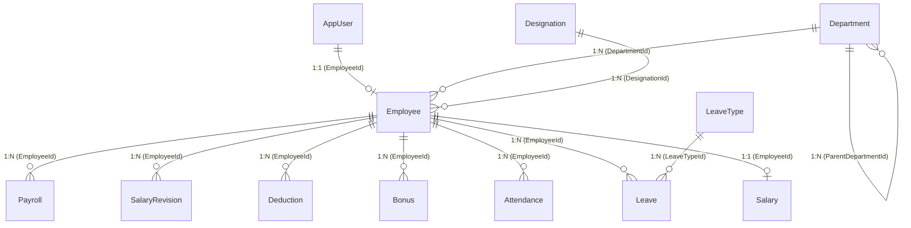

# Database Architecture & Communication Process

This document outlines the database architecture, communication process, and underlying design principles used in this Human Resource Management System (HRMS).

## 1. Database Technology Stack

* **Database Engine**: [SQLite](https://www.sqlite.org/) is used as the primary relational database for data persistence. It is lightweight, file-based, and ideal for straightforward local deployment and development.
* **Object-Relational Mapper (ORM)**: **Entity Framework Core (EF Core)** is used as the ORM to bridge the gap between the C# object-oriented models and the relational database tables.
* **Identity Management**: **ASP.NET Core Identity** (`Microsoft.AspNetCore.Identity.EntityFrameworkCore`) is integrated directly into the database to manage users (`AppUser`), roles, passwords, and authentication tokens.

## 2. Architecture Approach: Code-First

The system employs a **Code-First** architecture. This means:
1. **Domain Models First**: The database schema is not manually created. Instead, C# classes (Entities) are defined first in the `hrms-api/Models` directory.
2. **DbContext**: The `AppDbContext` class inherits from `IdentityDbContext<AppUser>` and acts as the central hub communicating with the database. It maps the C# entity classes to database tables using `DbSet<T>`.
3. **Migrations**: EF Core Migrations are used to track changes in the models and automatically generate SQL scripts to update the SQLite database schema (`.db` file).

## 3. Key Design Patterns & Features

### A. Soft Delete & Global Query Filters
Instead of permanently deleting records from the database, the system uses a **Soft Delete** pattern. 
* Entities inherit from an `AuditEntity` base class, which includes an `IsDeleted` boolean flag.
* EF Core's **Global Query Filters** are configured in `AppDbContext.OnModelCreating()`. For example, `builder.Entity<Employee>().HasQueryFilter(e => !e.IsDeleted);` ensures that any standard query automatically excludes soft-deleted records.

### B. Audit Trails
The `AuditEntity` base class provides built-in tracking for common entity changes:
* `CreatedAt`, `UpdatedAt`
* `CreatedBy`, `ModifiedBy`
This ensures accountability for when records were added or modified.

### C. Precision Configuration
Financial consistency is enforced at the database level. EF Core is configured to automatically apply `decimal(18,2)` precision and scale to all decimal properties across all models (e.g., Salary, Bonuses, Deductions).

## 4. Core Entities and Relationships

The database is structured around several modular domains:

* **Identity & Authentication**
  * `AppUser`: Extends standard IdentityUser. Represents the login account.
  * **Relationship**: `AppUser` has a 1-to-1 relationship with `Employee` (An employee profile linked to a system user).

* **Organizational Structure**
  * `Department`: Supports a self-referencing hierarchy (Parent/Sub-departments).
  * `Designation`: Defines job roles/titles within the company.

* **Employee Management**
  * `Employee`: The core profile containing personal and job-related details.
  
* **Payroll & Financials**
  * `Salary`: Represents the base compensation. Has a 1-to-1 relationship with `Employee`. Contains ignored computed columns (`GrossSalary`, `NetSalary`) which are evaluated at runtime rather than stored.
  * `SalaryRevision`, `Bonus`, `Deduction`: Track changes and dynamic elements of employee compensation.
  * `Payroll`: Represents a generated salary slip for a specific month/year.

* **Time & Attendance**
  * `Attendance`: Tracks daily clock-in/clock-out events.
  * `LeaveType` & `Leave`: Manages leave policies and employee leave requests.

* **System Utilities**
  * `Notification`: Manages system alerts for users.

## 5. Database Initialization

Upon application startup, the system automatically runs the following communication process:
1. **Migration Execution**: Checks for any pending EF Core migrations and applies them to the SQLite database (`db.Database.MigrateAsync()`).
2. **Seeding**: The `DbSeeder.cs` utility is executed. It ensures that essential default data exists:
   * **Roles**: Creates default roles (Admin, HR, Employee).
   * **Admin User**: Creates a default system administrator account if none exists.
   * **Sample Data**: Seeds initial departments and designations to make the system usable immediately.

## 6. Entity Relationship Diagram (ERD)

The following graphical representation illustrates the communication and relationships between the different tables in the HRMS database:



## 7. Common EF Core Queries Used in the Project

The HRMS API relies heavily on Entity Framework Core's LINQ-to-Entities capabilities to securely and efficiently communicate with the SQLite database. Below are the primary types of queries used throughout the application controllers (like `DashboardController`, `EmployeesController`, etc.) and the rationale behind their use.

### A. Filtering and Basic Retrieval (`Where`, `Select`)
Used to fetch specific data sets while minimizing memory footprint.

**Query Example (Leave Controller):**
```csharp
var types = await _db.LeaveTypes
    .Where(t => !t.IsDeleted)
    .Select(t => new LeaveTypeDto { Id = t.Id, Name = t.Name, MaxDaysPerYear = t.MaxDaysPerYear })
    .ToListAsync();
```
* **Why it's used**: 
  * `Where()` applies server-side filtering (converted to SQL `WHERE` clause) to ensure soft-deleted records are ignored.
  * `Select()` is used for **projection**. Instead of pulling all columns from `LeaveTypes` into memory, it only queries the `Id`, `Name`, and `MaxDaysPerYear`, mapping them directly into a Data Transfer Object (`LeaveTypeDto`). This significantly improves performance and reduces network/memory overhead.

### B. Eager Loading Related Data (`Include`)
Used to retrieve an entity along with its related navigation properties in a single database query, solving the N+1 query problem.

**Query Example (Dashboard Controller):**
```csharp
var history = await _db.Leaves
    .Include(l => l.LeaveType)
    .Where(l => l.EmployeeId == emp.Id)
    .OrderByDescending(l => l.CreatedAt)
    .Take(10)
    .ToListAsync();
```
* **Why it's used**: 
  * `Include(l => l.LeaveType)` forces EF Core to perform a SQL `JOIN` to bring in the associated `LeaveType` data. Without this, accessing `l.LeaveType.Name` later would either crash (if lazy loading is off) or cause an N+1 performance issue by making separate queries for each leave record.
  * `Take(10)` translates to SQL `LIMIT 10`, fetching only the 10 most recent entries, ensuring efficiency on the dashboard.

### C. Grouping and Aggregation (`GroupBy`, `Count`, `Sum`)
Used to compile statistics and analytics directly at the database layer.

**Query Example (Dashboard Controller - Payroll Trends):**
```csharp
var trendRaw = await _db.Payrolls
    .Where(p => p.Year == now.Year)
    .GroupBy(p => p.Month)
    .Select(g => new { Month = g.Key, Total = g.Sum(p => (double)p.NetSalary) })
    .ToListAsync();
```
* **Why it's used**:
  * Instead of pulling all payroll records into C# memory to calculate the total salary paid per month, `GroupBy` and `Sum` translate into SQL `GROUP BY` and `SUM()` aggregates.
  * The database engine performs the heavy mathematical calculation natively, returning only the grouped summary (Month and Total) to the C# application. This is vital for dashboard analytics.

### D. Sorting and Pagination (`OrderByDescending`, `Take`)
Used to fetch localized or specific chunks of data, usually for "Recent Activities" or lists.

**Query Example (Dashboard Controller - Recent Employees):**
```csharp
var recentEmps = await _db.Employees
    .OrderByDescending(e => e.Id)
    .Take(3)
    .Select(e => new ActivityDto { Description = $"New employee added: {e.FirstName} {e.LastName}", Timestamp = e.JoiningDate, Type = "Employee" })
    .ToListAsync();
```
* **Why it's used**:
  * Combining `OrderByDescending` with `Take(3)` ensures we only get the latest 3 employees registered in the system.
  * Translates into a highly optimized `ORDER BY Id DESC LIMIT 3` SQL query.

### E. Compound Filtering (`Where` with multiple conditions)
Used to find exact transactional records.

**Query Example (Attendance Controller):**
```csharp
var records = await _db.Attendances
    .Where(a => a.EmployeeId == employeeId && a.Date.Month == month && a.Date.Year == year)
    .ToListAsync();
```
* **Why it's used**:
  * Efficiently locates all attendance records for a single employee within a specific month and year without loading the entire attendance table.
